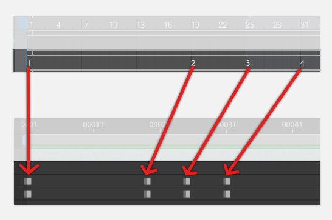

# Synchronize Timesheet

Import animation cel timing into After Effects from an XDTS Digital Timesheet file.



Features
- Instantly generate comps with correct frame positions.
- Resynchronize existing comps with updated timesheet data.
- Handle multiple timesheets at once within a single AE project.
- Customize behavior using a project-local configuration file.

'Synchronize Timesheet' is designed for digital animation workflows requiring
extensive compositing on individual cels. In particular, it was built to
support a pipeline where animation cels are drawn in Clip Studio Paint, colored
using PaintMan, and composited using After Effects. Additional usages may be
possible.

## Artist Guide

### Installation

1. Navigate to the [Releases]() page and download the latest release.
2. Open After Effects and install the script using `File > Scripts > Install Script File...`.
3. Run the plugin using `File > Scripts > Synchronize Timesheet.jsx`.

### Usage

#### Clip Studio Paint 4.0 Workflow

1. **Organize Cels for Export**\
	Open the Clip Studio Paint file containing your animation.\
	Ensure animation folders are named correctly.\
	Ensure cel names are numbers. Use `Animation > Edit track > Rename in timeline order` to replace names such as `2c` with a simple cel number.\
	Export animation cels using `File > Export animation > Export animation cels...`.\
	Export the timesheet using `File > Export animation > Exposure sheet...`. Use the `.XDTS` format.

2. **Setup XDTS Import Folder**\
	Create or open an After Effects project.\
	Ensure the project is saved to the disk.\
	In your file explorer, locate the project file (`<project-name>.aep`) and create a folder named `XDTS` adjacent to the project's `.aep` file.\
	Place your XDTS timesheet exported from Clip Studio Paint into the newly-created `XDTS` folder.

3. **Setup SyncFolders**\
	Open the After Effects project and navigate to the Project panel.\
	Create a folder and give it the name `[<timesheet>.xdts]` where timesheet is the exact name of the XDTS file surrounded by square brackets.\
	Create a subfolder within `[<timesheet>.xdts]` named `Input` and import the cels from Clip Studio Paint as image sequences.\
	Rename each image sequence to match the exact name of its associated animation folder. In particular, remove extraneous text in the sequence names such as the frame range and the original image extension.

4. **Run Synchronization Plugin**\
  Run the synchronization plugin using `File > Scripts > Synchronize Timesheet.jsx`.\
	If the plugin generates popups, follow the instructions to identify the problem. Rerun the plugin until there are no warnings.\
	On successful completion, multiple AE comps will be generated containing the original cels with the applied timesheet information.

### Troubleshooting

**I changed my cel timing in Clip Studio Paint, what should I do?**\
Re-export the timesheet using `File > Export animation > Exposure sheet...`.\
Replace the existing XDTS file in your `XDTS` folder with the updated timesheet.\
Rerun the plugin to apply the updated changes.

**I redrew some of my cels in Clip Studio Paint, what should I do?**\
Re-export the cels using `File > Export animation > Export animation cels...`.\
Replace the actual images of the image sequences that are being read by After Effects using your system's native file explorer.\
Return to After Effects and refresh your raw cels.\
The plugin is designed retime cels. It should not be necessary to rerun the plugin if the timesheet has not changed.

**Oops, I didn't mean to run the plugin, how do I make it go back?**\
Use `Edit > Undo Synchronize Timesheet` to undo any changes caused by the plugin.\
All effects of the plugin are organized into a single undo for convenience.

**I realized I accidentally left some important comps in the `[<timesheet>.xdts]` folder, what do I do?**\
The plugin will only affect items placed within the `Input` and `Comps` folder that match data within the timesheet. It is safe to leave other files within these folders, though not recommended.

## Advanced Usage

### Configuration File

It is possible to customize the execution of the plugin using a special
project-local configuration file. Create a file named `xdts-sync.json` and add
this to the AE project. Use a text editor to edit the contents of this file to
add customization options.

```js
// xdts-sync.json

// These comments are for instructional purposes, do not include them in the real xdts-sync.json file.
//
// The values provided are the defaults used by the plugin. It is safe to omit options that you don't plan on changing.
{
	// The path to the timesheet folder, relative to the projects .aep file
	timesheetFolder: './XDTS',

	// The name of the subfolder within a syncfolder that contains raw image sequence footage
	inputFolder: 'Input',

	// The name of the subfolder within a syncfolder that contains the timed AE comps
	outputFolder: 'Comps',

	// The starting frame of animation folders, reserved for future use
	startFrame: 1,

	// Additional customization, reserved for future use
	overrides: {}
}
```

Keep in mind this is a `.json` file and must adhere to the strict rules of the `json` format.

The file can be placed anywhere within the After Effects project.


## For Developers

This repository contains only the minimal resources required to edit and maintain the plugin.

The `.vscode/settings.json` file configures `.jsx` extension to be normal
JavaScript instead of React JSX files. Additional resources can be found by
searching for After Effects plugin scripting help.

### Useful Links

- [After Effects CS6 Scripting Guide](http://download.macromedia.com/pub/developer/aftereffects/scripting/After-Effects-CS6-Scripting-Guide.pdf) - Documentation for DOM and AE plugin development.
- [ExtendScript Scripting Guide](https://extendscript.docsforadobe.dev/) - Documentation for ExtendScript, including non-AE specific topics.

### Testing

Testing for this plugin was done using CSP 4.0 and After Effects 2025 on Windows 10.

### Pull Requests and Recommendations

The original author is a bit busy right now so there is no timeframe to process
pull requests and non-critical suggestions. Feel free to fork and improve this
repository if you need to create major changes. If you do fork it, please
acknowledge the original repository by including accreditation and a link to
this repository.